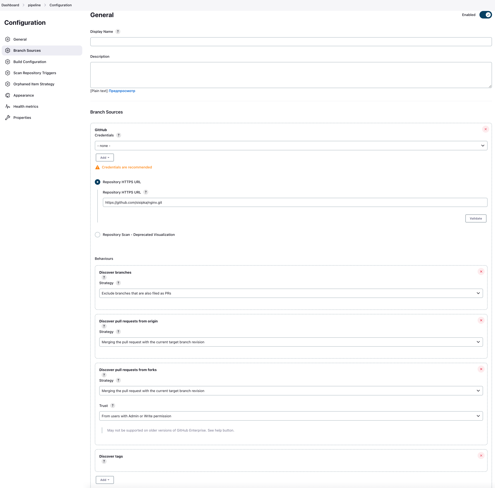
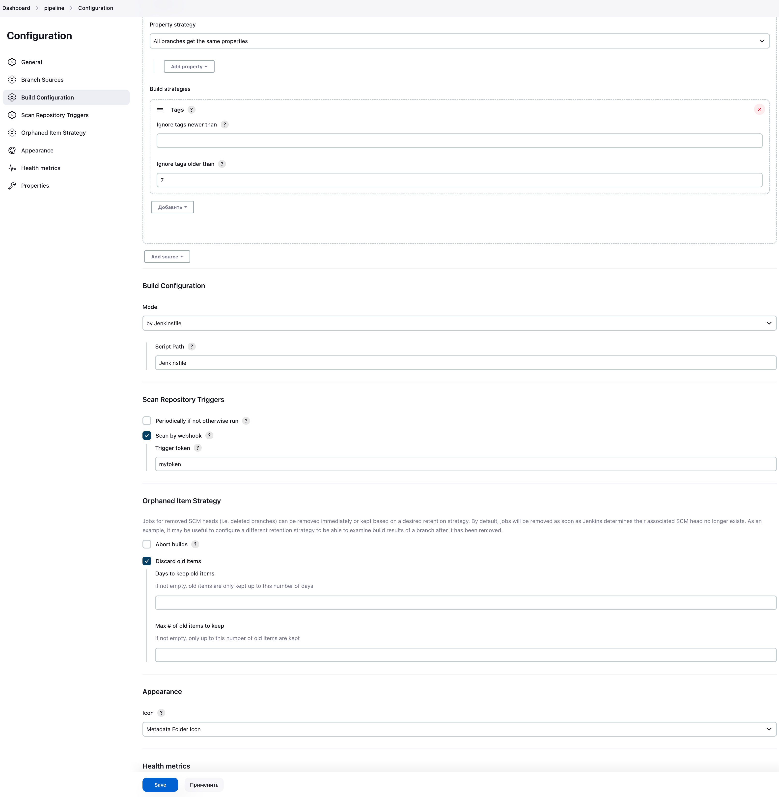
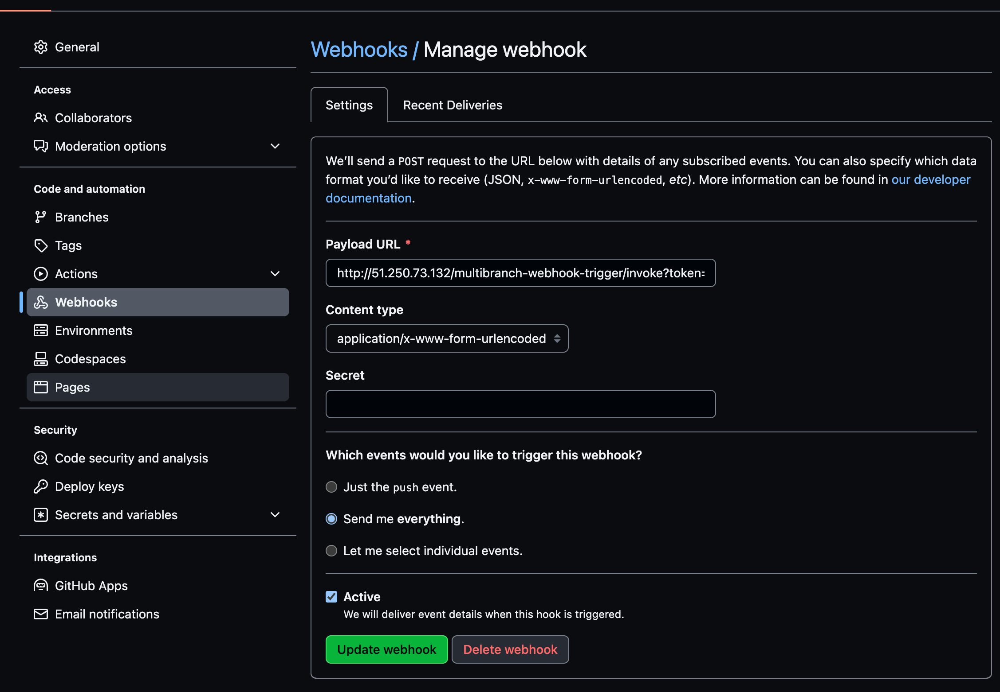

Создание тестового приложения для дипломного практикума.

Регистр с собранным docker image:

https://hub.docker.com/repository/docker/sisipka/nginx/general

Задание:

При любом коммите в репозиторие с тестовым приложением происходит сборка и отправка в регистр Docker образа. Здесь не должен запускаться деплой в k8s

При создании тега (например, v1.0.0) происходит сборка и отправка с соответствующим label в регистр, а также деплой соответствующего Docker образа в кластер Kubernetes.

Для реализации данного задания был выбран github и jenkins:

1. Настройка Jenkins

- Dashboard Jenkins → Управление плагинами → Устанавливаем плагины **Multibranch Scan Webhook Trigger** и **Basic Branch Build Strategies**

- Dashboard Jenkins → Новый элемент → Назование проекта → Выберите Multibranch Pipeline → нажмите Ok 

- Внутри проекта:

  

  

  

